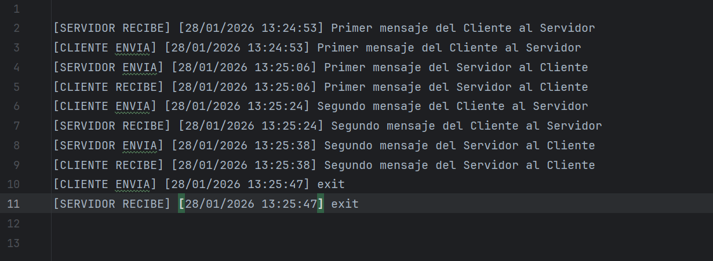

# Chat TCP bireccional Multihilo

Crea chat TCP bidireccional con hilos con un sistema de logging que guarde todos los mensajes enviados
y recibidos en un archivo de texto.

## Planteamiento

- Aquí hay un problema de concurrencia porque dos hilos van a estar escribiendo en el mismo fichero.
Por tanto, el fichero va a ser un recurso compartido que hay que proteger. 

- Se crea una clase ChatUtils con un método estático y synchronised 
 para escribir en el fichero. De este modo, solo un hilo puede utilizar ese método a la vez.

- El cliente y el servidor escribirán en el fichero cuando reciben y envían el mensaje. 

-En la clase ChatUtils se  incorporán métodos para construir fechas formateadas y el mensaje a escribir en el log.

##  Clases

`ChatUtils`
- Clase utilitaria que maneja el log del chat.
- Contiene métodos estáticos:
    - `write(String message)` → escribe un mensaje en el log de forma sincronizada.
    - `buildFormattedDate()` → devuelve la fecha y hora actual formateada.
    - `buildMessage(String role, String direction, String message)` → construye el mensaje completo para el log con rol, dirección y fecha.

`Client`
- Cliente TCP que se conecta al servidor.
- Tiene un hilo principal para enviar mensajes y un hilo receptor para recibir mensajes.
- Cada mensaje enviado o recibido se escribe en el log usando `ChatUtils`.

`Server`
- Servidor TCP que acepta conexiones de clientes.
- Tiene un hilo principal para enviar mensajes al cliente y un hilo receptor para recibirlos.
- Cada mensaje enviado o recibido se escribe en el log usando `ChatUtils`.

## Resultado del log 

## Notas 
- Hay que ejecutar primero la clase Server y a continuación la clase Client. Una vez ejecutado el servidor, espera a que el cliente se conecte.

- Para interrumpir el chat, se usa la parabra `exit`.